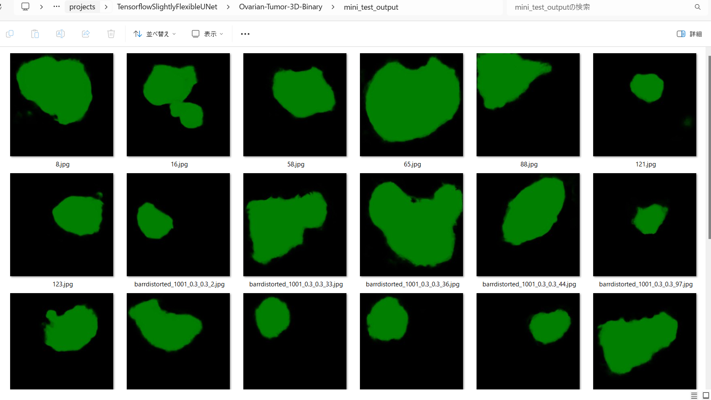
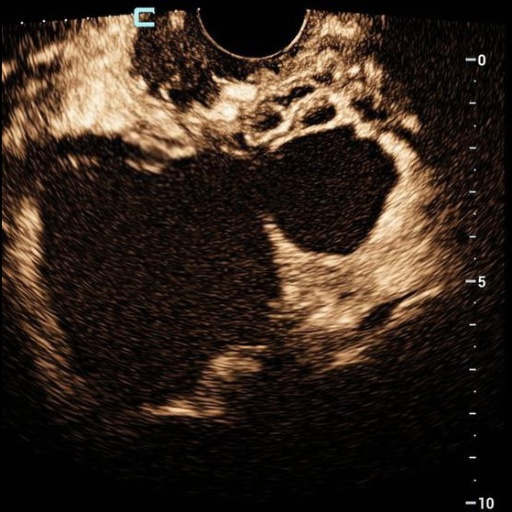

<h2>Tensorflow-Image-Segmentation-Ovarian-Tumor-3D (2024/08/01)</h2>
 

This is the first experiment of Image Segmentation for <a href="https://drive.google.com/drive/folders/1c5n0fVKrM9-SZE1kacTXPt1pt844iAs1">
OTU-3d (Ovarian Tumor 3d)
</a>
 based on
the <a href="https://github.com/sarah-antillia/Tensorflow-Image-Segmentation-API">Tensorflow-Image-Segmentation-API</a>,  
In this experiment, we aim to demonstrate that a pre-augmented dataset is effective in improving the generalization performance 
of a deep learning model for image segmentation. 
 
The original image dataset OTU_3d used here has been taken from the following google drive.
 
<a href="https://drive.google.com/drive/folders/1c5n0fVKrM9-SZE1kacTXPt1pt844iAs1">MMOTU</a>
 
 
It contains three types of annotations: rgb, binary and binary_binary. In this experiment, for simplicity, 
we focus only on the binary annotation type on training process.
The number of the image files in OTU_3d dataset is 170, which is too small to use directly for training to our segmentation model
without any preprocessing.
Hence, we applied the following image transformation methods to the original dataset to augment them to create 
a <b>pre-augmented dataset</b>.
For more details, please refer to <a href="./generator/ImageMaskDatasetGenerator.py">ImageMaskDatasetGenerator.py</a>. 
 
<ul>
<li>horizontal flipping</li>
<li>vertical flipping</li>
<li>rotation</li>
<li>shrinking</li>
<li>shearing</li
<li>deformation</li>
<li>distortion</li>
<li>barrel distortion</li>
<li>pincushion distortion</li>
</ul>
 
In this experiment, we applied an <b>RGB-to-HSV</b> color conversion to the input images for training and evaluation processes 
to improve segmentation accuracy. 
 
<table>
<tr>
<th>RGB</th>
<th>HSV</th>
<th>Mask</th>
</tr>
<tr>
<td></td>
<td></td>
<td></td>
</tr>
</table>
 

<b>Actual Image Segmentation</b> 
The inferred green-colorized masks predicted by our segmentation model trained on the Ovarian-Tumor ImageMaskDataset 
look similar to the ground truth masks. 
<table>
<tr>
<th>Input: image</th>
<th>Mask (ground_truth)</th>
<th>Prediction: inferred_mask</th>
</tr>
<tr>
<td></td>
<td></td>
<td></td>
</tr>
<tr>
<td></td>
<td></td>
<td></td>
</tr>

<tr>
<td></td>
<td></td>
<td></td>
</tr>
</table>

 
In this experiment, we have used the simple UNet Model 
<a href="./src/TensorflowUNet.py">TensorflowSlightlyFlexibleUNet</a> for this Oral Cancer Segmentation. 
As shown in <a href="https://github.com/sarah-antillia/Tensorflow-Image-Segmentation-API">Tensorflow-Image-Segmentation-API</a>.
you may try other Tensorflow UNet Models: 

<li><a href="./src/TensorflowSwinUNet.py">TensorflowSwinUNet.py</a></li>
<li><a href="./src/TensorflowMultiResUNet.py">TensorflowMultiResUNet.py</a></li>
<li><a href="./src/TensorflowAttentionUNet.py">TensorflowAttentionUNet.py</a></li>
<li><a href="./src/TensorflowEfficientUNet.py">TensorflowEfficientUNet.py</a></li>
<li><a href="./src/TensorflowUNet3Plus.py">TensorflowUNet3Plus.py</a></li>
<li><a href="./src/TensorflowDeepLabV3Plus.py">TensorflowDeepLabV3Plus.py</a></li>

 

<h3>1 Dataset Citation</h3>
The original image dataset OTU_3d used here has been taken from the following google drive.
<a href="https://drive.google.com/drive/folders/1c5n0fVKrM9-SZE1kacTXPt1pt844iAs1">MMOTU</a>
 
Please see also <a href="https://arxiv.org/pdf/2207.06799"><b>
MMOTU: A Multi-Modality Ovarian Tumor Ultrasound Image Dataset
for Unsupervised Cross-Domain Semantic Segmentation</b></a> 
 

<h3>2 Ovarian-Tumor-3D-Binary ImageMask Dataset</h3>
<h3>2.1 Download OTU_3d dataset</h3>
 If you would like to train this Ovarian-Tumor-3D-Binary Segmentation model by yourself,
please download the OTU-3d from google drive:
<a href="https://drive.google.com/drive/folders/1c5n0fVKrM9-SZE1kacTXPt1pt844iAs1">MMOTU</a>
,expanded it, and move the expanded <b>OTU_3d</b> under <b>./generator</b> directory as shown below. 
<pre>
./generator
├─OTU_3d
│  ├─annotatations
│  │  ├─1.PNG
│  │  ├─1_binary.PNG
│  │  ├─1_binary_binary.PNG
...
│  │  ├─170.PNG
│  │  ├─170_binary.PNG
│  │  └─170_binary_binary.PNG

│  ├─images
│  │  ├─1.JPG
│  │  ├─2.JPG
...
│  │  └─170.JPG
  ...       
├─ImageMaskDatasetGenerator.py
└─split_master.py
</pre>
<h3>2.2 Generate master dataset</h3>

Next, please run the following  command for <a href="./generator/ImageMaskDatasetGenerator.py">ImageMaskDatasetGenerator.py
</a>
<pre>
>python ImageMaskDatasetGenerator.py Binary
</pre> 

The constructor ImageMaskDatasetGenerator in ImageMaskDatasetGenerator.py takes some parameters as shown below. 
<pre>
   type                 = "RGB"
    if len(sys.argv) == 2:
      type = sys.argv[1]
    if not (type == "RGB" or type== "Binary"):
      error = "Invalid type: specify RGB or Binar"
      raise Exception(error)

    input_images_dir  = "./OTU_3d/images/"     
    input_masks_dir   = "./OTU_3d/annotations/" 

    output_images_dir = "./Ovarian-Tumor-3D-master-" + type + "/images/"
    output_masks_dir  = "./Ovarian-Tumor-3D-master-" + type + "/masks/"
    #...
    size         = 512
    augmentation = True
  
    generator = ImageMaskDatasetGenerator(size = size, 
                                          type = type,
                                         augmentation = augmentation)
    generator.generate(input_images_dir, input_masks_dir, 
                        output_images_dir, output_masks_dir)
  except:
    traceback.print_exc()
</pre>
If you would like eight categorical RGB mask dataset, please specify RGB as a command line parameter.
<pre>
>python ImageMaskDatasetGenerator.py RGB
</pre> 
On more detail, please see also <a href="https://arxiv.org/pdf/2207.06799"><b>
MMOTU: A Multi-Modality Ovarian Tumor Ultrasound Image Dataset
for Unsupervised Cross-Domain Semantic Segmentation</b></a> 
By the command above, 512x512 pixel-size image-mask master dataset will be created in <b>generator</b> folder.  
<pre> 
./Ovarian-Tumor-3D-master-" + type 
 ├─images
 └─masks
</pre>
 
<h3>2.3 Split master</h3>
Please run the following command for Python script <a href="./generator/split_master.py">split_master.py</a>
<pre>
>python split_master.py
</pre>
By this command, <b>Ovarian-Tumor-3D-Binary</b> dataset will be created under <b>./dataset</b> folder. 

<pre>
./dataset
└─Ovarian-Tumor-3D-Binary
    ├─test
    │   ├─images
    │   └─masks
    ├─train
    │   ├─images
    │   └─masks
    └─valid
        ├─images
        └─masks
</pre>

<b>Ovarian-Tumor-3D-Binary Dataset Statistics</b> 
 

 

<b>Train_images_sample</b> 

 
<b>Train_masks_sample</b> 

 

<h3>3 Train TensorflowUNet Model</h3>
 We have trained Ovarian-Tumor-3D-Binary TensorflowUNet Model by using the following
<a href="./projects/TensorflowSlightlyFlexibleUNet/Ovarian-Tumor-3D-Binary/train_eval_infer.config"> <b>train_eval_infer.config</b></a> file.  
Please move to ./projects/Ovarian-Tumor-3D-Binary and run the following bat file. 
<pre>
>1.train.bat
</pre>
This simply runs the following command. 
<pre>
>python ../../../src/TensorflowUNetTrainer.py ./train_eval_infer.config
</pre>

<pre>
; train_eval_infer.config
; 2024/08/01 (C) antillia.com

[model]
model          = "TensorflowUNet"
generator      = False
image_width    = 512
image_height   = 512
image_channels = 3
input_normalize = False
normalization  = False
num_classes    = 1
base_filters   = 16
base_kernels   = (7,7)
num_layers     = 8
dropout_rate   = 0.05
learning_rate  = 0.0001
clipvalue      = 0.5
dilation       = (1,1)
;loss           = "bce_iou_loss"
loss           = "bce_dice_loss"
;metrics        = ["binary_accuracy"]
metrics        = ["dice_coef"]
show_summary   = False

[train]
epochs        = 100
batch_size    = 2
steps_per_epoch  = 200
validation_steps = 80
patience      = 10

;metrics       = ["iou_coef", "val_iou_coef"]
metrics       = ["dice_coef", "val_dice_coef"]
;metrics       = ["binary_accuracy", "val_binary_accuracy"]

model_dir     = "./models"
eval_dir      = "./eval"
image_datapath = "../../../dataset/Ovarian-Tumor-3D-Binary/train/images/"
mask_datapath  = "../../../dataset/Ovarian-Tumor-3D-Binary/train/masks/"

;Inference execution flag on epoch_changed
epoch_change_infer     = True

; Output dir to save the inferred masks on epoch_changed
epoch_change_infer_dir =  "./epoch_change_infer"

;Tiled-inference execution flag on epoch_changed
epoch_change_tiledinfer     = False

; Output dir to save the tiled-inferred masks on epoch_changed
epoch_change_tiledinfer_dir =  "./epoch_change_tiledinfer"

; The number of the images to be inferred on epoch_changed.
num_infer_images       = 1
create_backup  = False

learning_rate_reducer = True
reducer_factor     = 0.3
reducer_patience   = 5
save_weights_only  = True

[eval]
image_datapath = "../../../dataset/Ovarian-Tumor-3D-Binary/valid/images/"
mask_datapath  = "../../../dataset/Ovarian-Tumor-3D-Binary/valid/masks/"

[test] 
image_datapath = "../../../dataset/Ovarian-Tumor-3D-Binary/test/images/"
mask_datapath  = "../../../dataset/Ovarian-Tumor-3D-Binary/test/masks/"

[infer] 
images_dir    = "./mini_test/images"
output_dir    = "./mini_test_output"

[segmentation]
colorize      = True
black         = "black"
white         = "green"
blursize      = None

[image]
;color_converter = None
color_converter = "cv2.COLOR_BGR2HSV_FULL"
gamma           = 0

[mask]
blur      = False
blur_size = (3,3)
binarize  = False
;threshold = 128
threshold = 80

[generator]
debug        = False
augmentation = True

[augmentor]
vflip    = True
hflip    = True
rotation = True
angles   = [30, 60, 90, 120, 180, 210, 240, 270, 300,330]
shrinks  = [0.8]
shears   = [0.1]

deformation = True
distortion  = True
sharpening  = False
brightening = False
barrdistortion = True

[deformation]
alpah     = 1300
sigmoids  = [8.0,]

[distortion]
gaussian_filter_rsigma= 40
gaussian_filter_sigma = 0.5
distortions           = [0.02, 0.03]

[barrdistortion]
radius = 0.3
amount = 0.3
centers =  [(0.3, 0.3), (0.7, 0.3), (0.5, 0.5), (0.3, 0.7), (0.7, 0.7)]

[sharpening]
k        = 1.0

[brightening]
alpha  = 1.2
beta   = 10  

</pre>

<b>Model parameters</b> 
Defined small <b>base_filters</b> and large <b>base_kernels</b> for the first Conv Layer of Encoder Block of 
<a href="./src/TensorflowUNet.py">TensorflowUNet.py</a> 
and large num_layers (including a bridge between Encoder and Decoder Blocks).
<pre>
[model]
base_filters   = 16 
base_kernels   = (7,7)
num_layers     = 8
</pre>

<b>Online augmentation</b> 
Disabled our online augmentation.  
<pre>
[model]
model         = "TensorflowUNet"
generator     = False
</pre>

<b>Loss and metrics functions</b> 
Specified "bce_dice_loss" and "dice_coef".
<pre>
[model]
loss           = "bce_dice_loss"
metrics        = ["dice_coef"]
</pre>
<b>Learning rate reducer callback</b> 
Enabled learing_rate_reducer callback. 
<pre> 
[train]
learning_rate_reducer = True
reducer_factor     = 0.3
reducer_patience   = 5
</pre>
<b>Early stopping callback</b> 
Enabled early stopping callback with patience parameter.
<pre>
[train]
patience      = 10
</pre>
<b>Color converter</b> 
Defined BGR2HSV color converter.
<pre>
[image]
color_converter = "cv2.COLOR_BGR2HSV_FULL"
</pre>
<b>Epoch change inference callback</b> 
Enabled EpochChange infer callback.
<pre>
[train]
epoch_change_infer     = True
epoch_change_infer_dir =  "./epoch_change_infer"
num_infer_images       = 1
</pre>

By using this EpochChangeInference callback, on every epoch_change, the inference procedure can be called
 for an image in <b>mini_test</b> folder. This will help you confirm how the predicted mask changes at each epoch during your training process.    

<b>Epoch_change_inference output</b> 
 
 
 
In this case, the training process stopped at epoch 50 by EarlyStopping Callback as shown below. 
<b>Training console output</b> 
 
 
 
<a href="./projects/TensorflowSlightlyFlexibleUNet/Ovarian-Tumor-3D-Binary/eval/train_metrics.csv">train_metrics.csv</a> 
 

 
<a href="./projects/TensorflowSlightlyFlexibleUNet/Ovarian-Tumor-3D-Binary/eval/train_losses.csv">train_losses.csv</a> 
 

 

<h3>4 Evaluation</h3>
Please move to a <b>./projects/TensorflowSlightlyFlexibleUNet/Ovarian-Tumor-3D-Binary</b> folder, 
and run the following bat file to evaluate TensorflowUNet model for Ovarian-Tumor-3D-Binary. 
<pre>
./2.evaluate.bat
</pre>
This bat file simply runs the following command.
<pre>
python ../../../src/TensorflowUNetEvaluator.py ./train_eval_infer_aug.config
</pre>

<b>Evaluation console output</b> 

  

<a href="./projects/TensorflowSlightlyFlexibleUNet/Ovarian-Tumor-3D-Binary/evaluation.csv">evaluation.csv</a> 

The loss (bce_dice_loss) for this test is low, and dice_coef high. 
<pre>
loss,0.087
dice_coef,0.9201
</pre>

<h3>
5 Inference
</h3>
Please move to a <b>./projects/TensorflowSlightlyFlexibleUNet/Ovarian-Tumor-3D-Binary</b> folder 
,and run the following bat file to infer segmentation regions for images by the Trained-TensorflowUNet model for Ovarian-Tumor-3D-Binary. 
<pre>
./3.infer.bat
</pre>
This simply runs the following command.
<pre>
python ../../../src/TensorflowUNetInferencer.py ./train_eval_infer_aug.config
</pre>

<b>mini_test_images</b> 
 
<b>mini_test_mask(ground_truth)</b> 
 

<b>Inferred test masks</b> 
 
 

<b>Enlarged Images and Masks Comparison</b> 
<table>
<tr>
<th>Image</th>
<th>Mask (ground_truth)</th>
<th>Inferred-mask</th>
</tr>

<tr>
<td></td>
<td></td>
<td></td>
</tr>

<tr>
<td></td>
<td></td>
<td></td>
</tr>

<tr>
<td></td>
<td></td>
<td></td>
</tr>

<tr>
<td></td>
<td></td>
<td></td>
</tr>

<tr>
<td></td>
<td></td>
<td></td>
</tr>

</table>

 
 

<h3>
Reference
</h3>
<b>1.MMOTU: A Multi-Modality Ovarian Tumor Ultrasound Image Dataset
for Unsupervised Cross-Domain Semantic Segmentation</b> 
Qi Zhaoa, Shuchang Lyua, Wenpei Baib, Linghan Caia, Binghao Liu, Guangliang Chengc 
Meijing Wub, Xiubo Sangb, Min Yangb,∗∗ and Lijiang Chena, 
<a href="https://arxiv.org/pdf/2207.06799">https://arxiv.org/pdf/2207.06799</a> 

 
